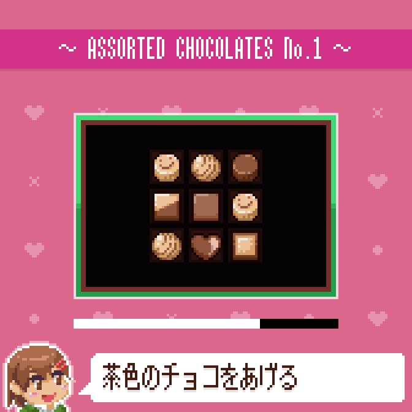

# chocokurei2023

## 概要

[プロ生ちゃんチョコプログラミングコンテスト2023](https://pronama.jp/2023/02/09/valentine-contest-2023/)への応募作品です。

プロ生ちゃんからたくさんチョコをもらえるミニゲームを作りました。

## ルール

操作はマウスのみです。プロ生ちゃんが食べていいと言ったチョコを選んで食べていってください。

エンディングは2種類用意しています。

## 確認済みの動作環境

- Windows 11

## 開発環境

- Windows 11
- Visual Studio 2022
- [OpenSiv3D](https://github.com/Siv3D/OpenSiv3D) v0.6.6

## ライセンス

[MIT Lisence](./LICENSE)

## スクリーンショット

